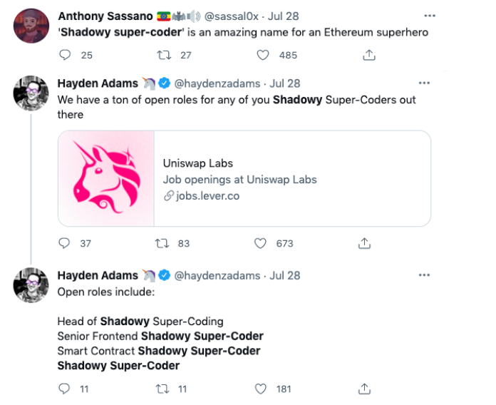

# Shadowy Super Coder Proposal
##Background
A couple of days ago, U.S. Senator Elizabeth Warren expressed that _**"Crypto Puts Financial System in the Hands of 
'Shadowy Super-Coders'"**_. 
Check out the full story [here](https://decrypt.co/76997/elizabeth-warren-crypto-big-banks-shadowy-super-coders). 
This quickly turned into a trending meme on CT:



While crypto skeptics make criticisms, we want to give tributes to all Shadowy Super-Coder out there who contributed to
the blockchain ecosystem!

## Snapshot
This repo contains queries run on [ethereum public dataset on google bigquery](https://bigquery.cloud.google.com/dataset/bigquery-public-data:crypto_ethereum)
which are used for the NFT and perk drop. Here are the rules and result:
which are used for the NFT and perk drop.
```sql
todo add query here.
```

### Eligible Users
87,778 Ethereum addresses who:
1. Deployed at least 1 contract on Ethereum mainnet.
2. Deployed contracts that had at least 2 different addresses interacted.

These addresses are ranked in two tiers:

1. **6,933 Shadowy Super-Coders**: those that served >=500 unique addresses & contracts had at least 1 transaction in 2021.
2. **80,845 Shadowy Coders**: those that served less <500 unique addresses || served >=500 but have no active tx since 2021

Special shout out to our Super-Coder friend @Banteg who helped curate data

[comment]: <> (there are ~200k addresses that deployed contract on ethereum mainnet, and we added the following requirements on top:)

[comment]: <> (1. filtered out addresses whose contract creation transactions all failed)

[comment]: <> (2. filtered out addresses whose contracts had a total of 0 or 1 unique address that interacted)

[comment]: <> (3. filtered out addresses whose contracts did not have any transaction in 2021)

[comment]: <> (After filtering, there are 38,534 addresses left, and we used # of unique addresses that interacted to rank them in 2 tiers:)

[comment]: <> (1. 6926 shadowy super coder: those that served >=500 unique addresses)

[comment]: <> (2. 31,608 shadowy coder: those that served less <500 unique addresses )

[comment]: <> (num of contracts deployed turned out not to be a good indicator since many addresses that deployed a lot of contracts were deploying spam tokens.)


